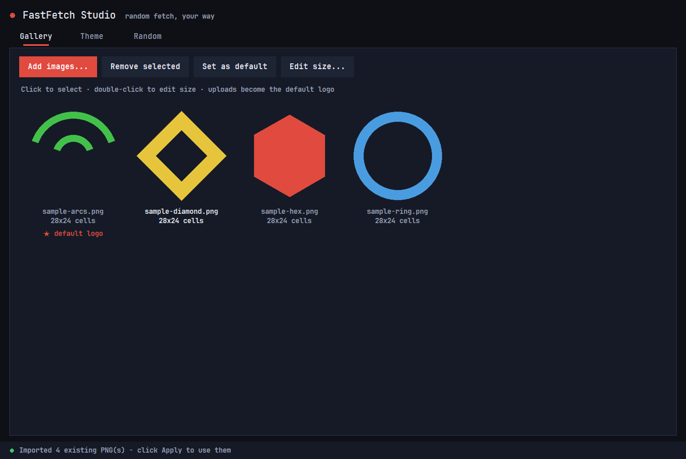

# FastFetch Studio

GUI customizer + random launcher for [fastfetch](https://github.com/fastfetch-cli/fastfetch) on Windows.

Pick images, color theming, and randomization in a small desktop app — every new terminal
window then shows a **random logo + random color theme** automatically.



## Download

Grab the standalone exe from [Releases](../../releases) — no Python or other dependencies
needed. Windows SmartScreen may warn on first run for unsigned exes: **More info → Run anyway**.

## Set up a fresh machine (one command)

No fastfetch yet, or don't want to touch `$PROFILE` by hand? One script installs fastfetch,
puts it on your `PATH`, and hooks it into Windows PowerShell 5.1 and PowerShell 7+ — no
Administrator rights needed, safe to re-run:

```powershell
irm https://raw.githubusercontent.com/Kirisos-Guna/FastFetchStudio/main/setup.ps1 | iex
```

It detects which shells you actually have, skips anything already installed, and refuses to
add a second fastfetch call if your profile already has one. See **[SETUP.md](SETUP.md)** for
options, verification, and uninstall.

## Features

- **Gallery tab** — upload PNG / JPG / WEBP / GIF / BMP images (auto-converted to PNG into
  `~\.config\fastfetch\pngs\`), thumbnail grid, per-image size in terminal cells,
  set a default/fallback logo.
- **Theme tab** — key colors per module group (OS, packages, terminal, CPU, driver, title),
  box border style (rounded / double / heavy / ASCII / none) and color, separator text,
  default logo size, palette-block toggle.
- **Random tab** — choose what randomizes per terminal open (logo, theme) and how often
  (every window or once per day).
- **Live preview** — renders the logo to a real sixel image and opens a preview in
  Windows Terminal.
- **8 palettes** — your exact colors plus 7 hue-rotated variants are generated so
  randomization has variety.
- **An icon on every row** — the generated config switches fastfetch's key icons on, so all
  thirteen labeled modules (chassis, OS, kernel, packages, display, terminal, WM, CPU, GPU,
  driver, memory, OS age, uptime) get a Nerd Font glyph, tinted with that row's key color.
  The glyph comes from fastfetch's own per-type default rather than being typed into each
  label, so adding a module can never leave a row icon-less. Needs a Nerd Font in your
  terminal; `fastfetch --key-type string` prints plain labels instead.

## What it generates

| File | Purpose |
|---|---|
| `~\.config\fastfetch\config.jsonc` | main fastfetch config (original backed up once to `config.backup.jsonc`) |
| `~\.config\fastfetch\themes\theme-01..08.jsonc` | the 8 palettes |
| `~\.config\fastfetch\fastfetch-random.ps1` | picks a random theme + logo each run (sixel on Windows Terminal, kitty-direct on WezTerm, built-in logo fallback). Written by **Apply & Generate**; `setup.ps1` writes a plain bootstrap here so the profile hook works before the app has ever run |
| `~\.config\fastfetch\gui\studio-state.json` | app state (gallery, colors, settings) |

## Hook it into PowerShell (one time)

Paste this into your `$PROFILE`, replacing any old fastfetch block:

```powershell
$ffLauncher = "$env:USERPROFILE\.config\fastfetch\fastfetch-random.ps1"
if (Test-Path -LiteralPath $ffLauncher) { & $ffLauncher } else { fastfetch.exe }
```

The `Test-Path` guard matters: `fastfetch-random.ps1` is a *generated* file. A bare
`& "$env:USERPROFILE\.config\fastfetch\fastfetch-random.ps1"` works once the file exists, but
on a machine where it does not yet, every new shell opens with

> `& : The term '...\fastfetch-random.ps1' is not recognized as the name of a cmdlet, function, script file, or operable program.`

A copy-pasteable snippet with a Copy button is also available inside the app (Theme tab).

Or let [setup.ps1](SETUP.md) do the download, the profile edit, *and* write the launcher for
you — including PowerShell 7+, which the app itself does not configure.

### Prerequisite: the execution policy must allow scripts

On a fresh Windows install the effective policy is `Restricted`, which blocks `.ps1` files
**and profiles**. Both the pasted line and the profile hook stay silent until you allow
signed-local scripts. This is user-scoped — no Administrator rights needed:

```powershell
Set-ExecutionPolicy -Scope CurrentUser RemoteSigned
```

Check it with `Get-ExecutionPolicy`. `setup.ps1 -FixExecutionPolicy` will do it for you.
If the policy is enforced by Group Policy, only your administrator can change it.

## Build from source

Requires Python 3.10+ on Windows.

```bat
build.bat
```

That installs `pillow` + `pyinstaller` and produces `dist\FastFetchStudio.exe`
(one portable file). The GitHub Actions workflow (`.github/workflows/build.yml`) builds
and attaches the exe to releases automatically.

## Uninstall

`.\setup.ps1 -Uninstall` removes the managed `$PROFILE` hook and the bootstrap launcher
(add `-RemoveBinary` to delete the fastfetch binary too). It leaves a launcher that
FastFetch Studio generated, since that is your own configuration.

To do it by hand: delete `~\.config\fastfetch\themes\`, `fastfetch-random.ps1`, the `gui\`
folder, and restore `config.backup.jsonc` over `config.jsonc`. Uploaded images stay in
`pngs\`.

## License

MIT — see [LICENSE](LICENSE).
